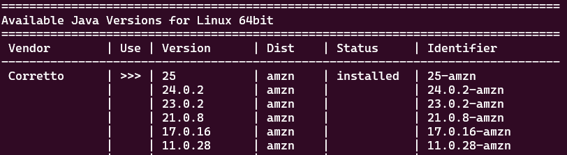
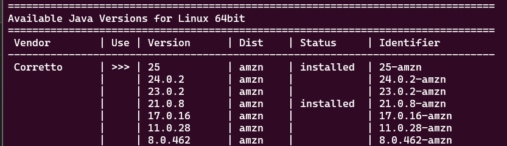

[Documentação Java](https://docs.oracle.com/javase/tutorial/java/nutsandbolts/datatypes.html)

#                         Instalar Java - Via SDKMAN.

| Comando                                       | Descrição                                                                                 |
| --------------------------------------------- | ----------------------------------------------------------------------------------------- |
| `java -version`                               | Verificar versão Java na máquina                                                          |
| 1 `curl -s "https://get.sdkman.io" \| bash`   | Baixa o instalador do SDKMAN da Internet e roda ele com o Bash                            |
| 2 `source "$HOME/.sdkman/bin/sdkman-init.sh"` | Executa o conteúdo desse arquivo dentro do terminal atual, e não em um terminal separado. |

| Comando       | Descrição                                                     |
| ------------- | ------------------------------------------------------------- |
| `curl`        | baixar itens da internet                                      |
| `-s`          | silent, sem mostrar o progresso da barra de download          |
| `(pipe) bash` | envia o conteúdo baixado direto pro bash, que excuta o script |
| `source`      | fonte, vai executar a partir daqui                            |

| Comando                                       | Descrição                                                           |
| --------------------------------------------- | ------------------------------------------------------------------- |
| 3 `sdk version`                               | Buscar a versão mais atualizada (ou a que será necessário utilizar) |
| 4 `sdk install java 25-amzn`                  | versão instalada                                                    |
| 5 `source "$HOME/.sdkman/bin/sdkman-init.sh"` | Executa dentro do terminal atual                                    |
| 6 `sdk current java`                          | Visualizar qual versão estou utilizando                             |
| `Using java version 25-amzn`                  | Exemplo de versão utilizada                                         |

 ```bash
 java -version
 openjdk version "25" 2025-09-16 LTS
OpenJDK Runtime Environment Corretto-25.0.0.36.2 (build 25+36-LTS)
OpenJDK 64-Bit Server VM Corretto-25.0.0.36.2 (build 25+36-LTS, mixed mode, sharing)
```

## Alterar terminal entre versões JAVA

| Comando                    | Descrição                               |
| -------------------------- | --------------------------------------- |
| `sdk current java`         | Visualizar qual versão estou utilizando |
| `sdk list java`            | Tabela de versões do Java               |
| `sdk install java *******` | escolher versão                         |
| `sdk use java ******`      | incluir versão que deseja utilizar      |
| `sdk default java *****`   | Atualizar versão como padrão            |

Antes de Baixar uma nova versão:


Depois de baixar uma nova versão:


-----

# Estrutura Básica do Programa

Em java, cada linha de código que é executada deve estar dentro de uma **classe**. A classe principal é chamada de `Main`

> Ao executar um programa Java, a **Java Virtual Machine (JVM)** procura o método main para começar a executar o código. Sem um método main, a JVM não saberia por onde começar.

```java
public class Main { // Declaração da CLASSE (nome do arquivo)
    public static void main(String[] args) { // MÉTODO principal
        System.out.println("Hi, Pam!"); // Declaração de SAÍDA (pulando uma linha)
    }
}
```

# Variável

> **Variáveis** são contêineres que armazenam valores de dados. Elas são usadas para armazenar, manipular e exibir informações dentro de um programa.

Para inicializar uma variável, usamos o seguinte formato:

```java
variable_type variable_name = value;
```

## Números

`int` e `double`

- [x] `int`: armazena números inteiros, sem nenhum ponto decimal.

```java
int idade = 34;
int peso = 75;
```

- [x] `double`: armazena números com um ponto decimal.

```java
double preço = 1.99;
double pi = 3.14159;
```

## String

`char` e `String`

- [x] `char`: armazena um único caractere.

```java
char numero = 4;
char letra = A;
```

- [x] `String`: armazena uma sequência de caracteres, multiplos chars.

```java
String s1 = "Continue a Nadar...";
String s2 = "Java é legal!";
```

______________________

# Compilar um Programa Java

:)

- Navegue até o diretório específico e localize o nome do arquivo -> `nome.java`
- Transformar o código-fonte (.java) em bytecode (.class)
- Rodar `javac nome.java`, gerará um aquivo `nome.class`
- No terminal, `java nome` (apenas o nome do arquivo sem a extensão (.java ou .class)
- Voalá!


_________________________________


| Comandos: JAVA                                    | Descrição                                 |
| :------------------------------------------------ | :---------------------------------------- |
| `;`                                               | Ao final de cada linha OBRIGATÒRIO ( ; )  |
| `//`                                              | Comentário de linha                       |
| `/* */`                                           | Comentário de texto                       |
| `&&`                                              | e (and)                                   |
| `\|\|`                                            | ou (or)                                   |
| `=`                                               | Pertence                                  |
| `==`                                              | Comparação                                |
| `%`                                               | Resto da divisão                          |
| `/`                                               | Quociente da divisão (feito com inteiros) |
| `"\n"`                                            | Pular linha                               |
| `?`                                               | if/se (operador ternário)                 |
| `:`                                               | else/se não (operador ternário)           |
| Operador cast: `(float)`                          | Utilizar em decimal                       |
| `case`                                            | caso                                      |
| `break`                                           | parada                                    |
| `default`                                         | Caso não encontre o resultado.            |
| `for`                                             | Para laço numérico                        |
| System.out.print();                               | Saída de Resultado                        |
| System.out.println();                             | Saída de Resultado + Pular Linha          |
| System.out.println(nomeDaVariavel.toUpperCase()); | Maiúsculas                                |
| System.out.println(nomeDaVariavel.toLowerCase()); | Minúsculas                                |
| System.out.println(nomeDaVariavel.length());      | Contagem caracteres                       |


<!--
# Iniciar um arquivo

- [x] class nomeClass
- [x] `psvm` chamar o `   public static void main`

**Ordem de prioridade em java**

- 1º tipo da variável;
- 2º seu nome;
- 3º atribuir um valor à variável.
```java
String nome = "Pamela";
```

**Run e Terminal**

Incluir no código para iniciarmos o Run:
```java
public static void main (String[] args){}
```

Para visualizarmos o resultado no terminal:
```java
System.out.println(soma);
```

**nomesDeVariaveis**

Para uma melhor visualização dos nomes das variáveis `saoFeitasDessaForma`. 
- Não é recomendado iniciar com números ou caracteres especiais.

**Usuário inclui informação**
`import java.util.Scanner;`
`Scanner nomeDaVariavel1 = new Scanner(System.in);`
`int nomeDaVariavel2 = nomeDaVariavel1.nextInt();`

_______________________________________________________________

# Compilar Arquivo Java no Prompt de Comando

- [x] Criar e Salvar Arquivo: nomeArquivo.java

```java
//Meu Primeiro Programa

//nome da classe
class MeuPrimeiroProgramaJava
{
    //módulo principal com a entrada pela linha de comando
    public static void main(String entrada[]) 
    {
        //declaração de variáveis
        int inteiro = 31;
        char caracter = 'F';
        double real  = 1.70;
        String frase = "Pamela Rondina";
        boolean VF=true;

        if (VF == true)
        {
            System.out.println("Eu sou a " + frase + ", tenho " + inteiro + " anos e " + real + "m de altura");
        }

        System.exit(0);

    }
}
```

- [x] No Prompt de Comando: localizar caminho de onde o arquivo está salvo:

- [x] Na pasta rodar:
    - [x] `path "C:\Program Files\Java\jdk-18.0.1.1\bin"`;
    - `dir *.java`;
    - [x] `javac nomeArquivo.java`;
    - `dir *.class`;
    - [x] `java nomeArquivo.java`.

```
> path "C:\Program Files\Java\jdk-18.0.1.1\bin"
> dir *.java
> javac Faculdade_aula_java_01.java
> dir *.class
> java Faculdade_aula_java_01.java
```
_________________________________________________________________

________________________________________________________________

| **MÉTODOS**                          | -                                                                            |
| ------------------------------------ | ---------------------------------------------------------------------------- |
| `Integer.parseInt(entrada[0]);`      | Os dados inclusos em java são em String, este método passa para **Inteiro**  |
| `Double.parseDouble(entrada[1]);`    | Os dados inclusos em java são em String, este método passa para **Real**     |
| `Caracter = (entrada[2]).charAt(0);` | Os dados inclusos em java são em String, este método passa para **Caracter** |
| `Math.sqrt(x);`                      | Raiz Quadrada                                                                |
| `Math.pow(x, y);`                    | Potência                                                                     |

________________________________________________________________

| **IMPORTS**                                                        | -                                           |
| ------------------------------------------------------------------ | ------------------------------------------- |
| `import java.util.Scanner;`                                        | Dado informado pelo usuário                 |
| **`import javax.swing.*;`**                                        | -                                           |
| `import javax.swing.*; JOptionPane.showInputDialog("Digite aqui")` | Usuário inclui o dado                       |
| `import javax.swing.*;JOptionPane.showMessageDialog(null, msg);`   | Dado que o usuário incluiu será visualizado |

_____________________________________________________________________
| **ATALHOS** | -                                          |
| ----------- | ------------------------------------------ |
| fori        | `for (int i = 0; j < args.length; j++) {}` |
| psvm        | `public static void main`                  |
-->