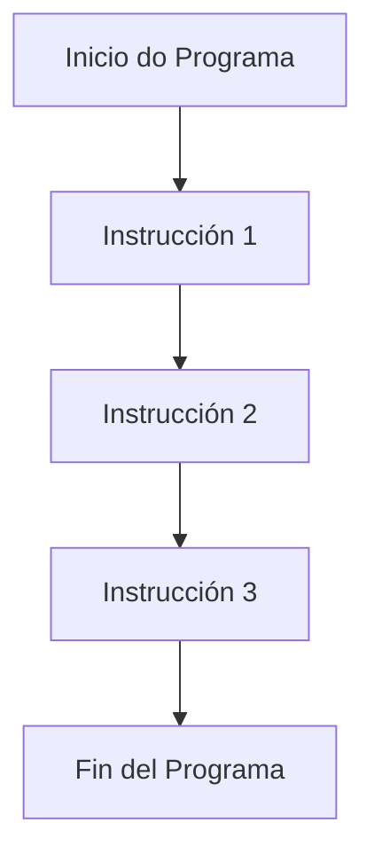
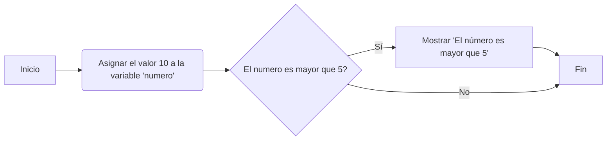
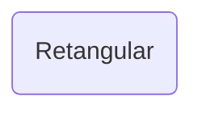
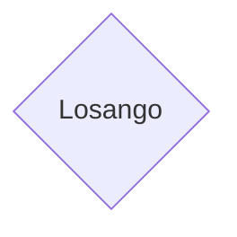

# Mermaid

Fluxograma na Vertical

____

---------

## Título

3 -
title: nome
3 -

## Estilo 

- graph
- flowcharts

## Horizontal ou Vertical

Nome | Descrição
-|-
graph TD | gráfico na Vertical
graph LR | gráfico na Horizontal 

## Linhas

**A --> B**

## ([Inicio])

## (Retangular)

## { Losango }

-----------

Site | Link
-|-
Mermaid.js | [Link](https://mermaid.js.org/syntax/flowchart.html)